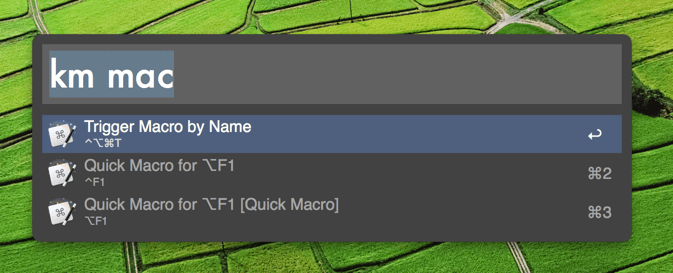

# Alfred Maestro ([Download][dl])

#### Activate any of your Keyboard Maestro macros in Alfred

This is a workflow for anyone who uses Keyboard Maestro and wishes it had built-in Alfred support. In Alfred simply type `km` followed by the name of any of your KM macros.

## Requirements

Alfred 3 with Powerpack and Keyboard Maestro 6.3 or greater.
If you don't have them, go get them immediately.
You will not regret it.

- [Alfred](http://www.alfredapp.com/) (Free, but requires £17 Powerpack)
- [Keyboard Maestro](http://www.keyboardmaestro.com/main/) (Free to try. $36/license)

Both well worth the cost.

## Installation

[Download the file directly][dl], then double-click _Alfred Maestro.alfredworkflow_ file to install.

[dl]: https://github.com/iansinnott/alfred-maestro/releases/download/0.2.1/AlfredMaestro.alfredworkflow

### Installing from sources
You can also compile and install this workflow from sources.
It's written in [Go](https://golang.org/), so you should install it first.

1. Clone this repository
2. Install [AwGo library](https://github.com/deanishe/awgo): `go get github.com/deanishe/awgo`
3. Run `make pack`
4. Double-click _Alfred Maestro.alfredworkflow_ file to install the workflow.

## Usage

Type `km` followed by the name of any of your defined macros.

I also wrote a blog post on how I personally use this workflow for anyone who's interested: [Integrating Alfred and Keyboard Maestro][blogpost]

[blogpost]: http://blog.iansinnott.com/integrating-alfred-and-keyboard-maestro/

#### Update:

Thanks to Peter Lewis of [Stairways Software][stair], the creator of Keyboard Maestro for adding a feature to KM that greatly increased the power of this workflow. Now Alfred can launch any of your macros, not just the ones with a hotkey!

[stair]: http://www.stairways.com/main/

## Possible Issues

### Application Specific Macro Groups

**Important:** If you have macros that you only want to run in certain applications read this.

If you create a macro group that is _not_ set to run in all applications you will need to make sure it is set to run in Alfred in addition to whatever application you want it to run in. See [issue 5][issue5] for details.

[issue5]: https://github.com/iansinnott/alfred-maestro/issues/5

## Troubleshooting

If you are having trouble, feel free to [open an issue][issues]. I try to check up on it regularly. Alternatively, ping me on Twitter: [@ian_sinn](https://twitter.com/ian_sinn)

[issues]: https://github.com/iansinnott/alfred-maestro/issues
[new-issue]: https://github.com/iansinnott/alfred-maestro/issues/new
